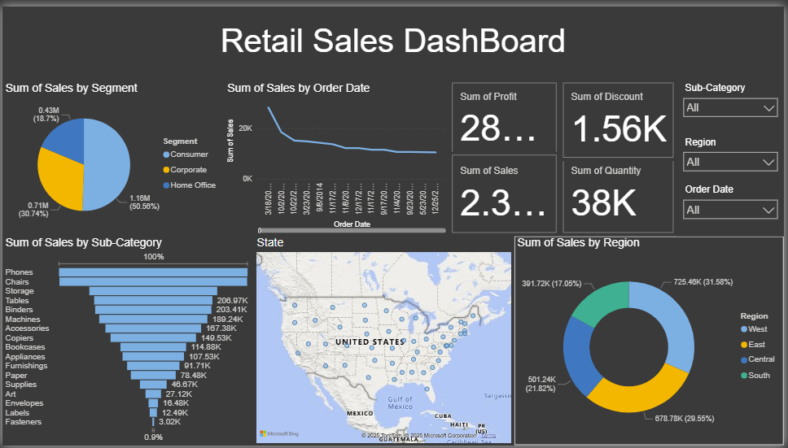

# 🛒 Retail Sales Dashboard | SQL & Power BI

## 📌 Project Overview
Analyzed retail sales data to provide insights into revenue, profit, discounts, and customer behavior.  
Goal: Build an **interactive Power BI dashboard** powered by **SQL queries**.

---

## 🛠️ Tools & Technologies
- **SQL (MySQL Workbench)** – Data cleaning, joins, aggregations  
- **Power BI** – Dashboard creation, visualization  
- **Excel (CSV)** – Data source  

---

## 📊 Steps Taken
1. **Data Preparation (SQL)**
   - Imported Superstore dataset into MySQL.  
   - Cleaned & formatted data (dates, duplicates, null values).  
   - Wrote queries: top customers, top products, sales by region, discount impact.  

2. **Visualization (Power BI)**
   - Connected SQL data to Power BI.  
   - Built KPIs: Total Sales, Profit, Quantity, Avg Discount.  
   - Added slicers: Year, Region, Category.  
   - Created visuals:  
     - Sales & Profit trend over time  
     - Category-wise performance  
     - Top 10 products  
     - Profit Margin by Region  
     - Sales vs Profit correlation  

---

## 🔑 Key Insights
- **Technology** category generated highest revenue; **Furniture** had lower profit margins.  
- Discounts above **20%** reduced profits significantly.  
- **Top 10 products** contributed most revenue.  
- Certain regions were consistently more profitable.  

---

## 📸 Dashboard Preview

---

